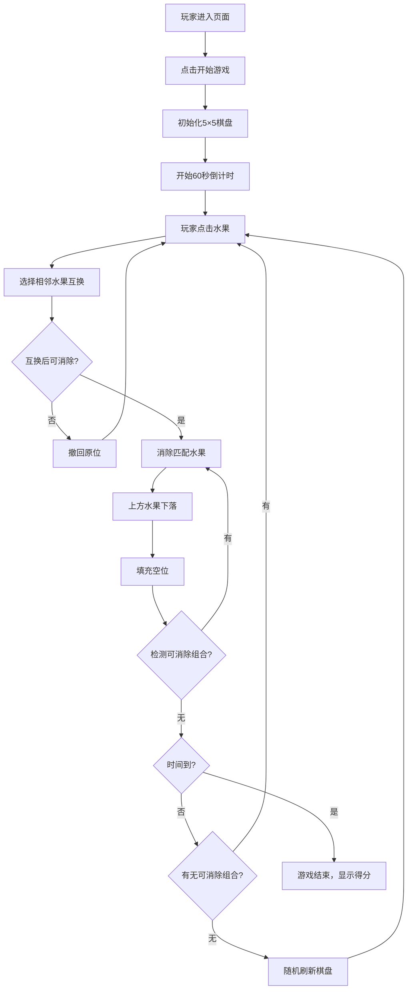

## 1. 产品概述

水果三消是一款休闲益智类网页小游戏，玩家通过互换相邻水果的位置，使横纵方向连成3个及以上相同水果来消除得分。游戏限时60秒，考验玩家的反应速度和策略思维。

- 主要用途：休闲娱乐，锻炼观察力和反应能力
- 目标用户：喜欢休闲小游戏的玩家
- 产品价值：提供轻松有趣的消除游戏体验

## 2. 核心功能

### 2.1 用户角色
| 角色 | 注册方式 | 核心权限 |
|------|---------|---------|
| 普通玩家 | 无需注册 | 开始游戏、进行操作、查看得分 |

### 2.2 功能模块
1. **游戏主界面**：5×5水果棋盘、得分显示、倒计时、开始/重新开始按钮
2. **棋盘交互**：点击选择水果、相邻互换、无效互换撤回
3. **消除逻辑**：横纵3连检测、自动消除、水果下落填充
4. **游戏控制**：60秒倒计时、无可消除组合自动刷新、游戏结束判定

### 2.3 页面详情
| 页面名称 | 模块名称 | 功能描述 |
|---------|---------|---------|
| 游戏主界面 | 顶部信息栏 | 显示当前得分、剩余时间、游戏状态 |
| 游戏主界面 | 5×5棋盘 | 水果显示、点击选择、互换动画、消除动画、下落动画 |
| 游戏主界面 | 控制按钮 | 开始游戏、重新开始 |
| 游戏主界面 | 结束弹窗 | 显示最终得分、重新开始选项 |

## 3. 核心流程

## 4. 用户界面设计

### 4.1 设计风格
- 主色调：清新明亮的渐变色彩（蓝紫色系作为背景，配合鲜艳的水果颜色）
- 辅助色：各水果使用鲜明区分的颜色（红、黄、绿、橙、紫）
- 按钮风格：圆角渐变按钮，带有悬停缩放动效
- 字体：使用活泼圆润的字体，数字显示清晰醒目
- 布局：居中卡片式布局，棋盘占据核心区域
- 图标：使用emoji作为水果图标（🍎🍋🍇🍊🥝），生动有趣

### 4.2 页面设计概述
| 页面名称 | 模块名称 | UI元素 |
|---------|---------|--------|
| 游戏主界面 | 顶部信息栏 | 得分数字（大号加粗）、倒计时进度条、时间数字 |
| 游戏主界面 | 5×5棋盘 | 网格背景、水果方块、选中高亮、消除闪烁动画、下落过渡动画 |
| 游戏主界面 | 控制区域 | 开始/重玩按钮（渐变样式）、游戏规则提示 |
| 游戏主界面 | 结束弹窗 | 半透明遮罩、卡片式弹窗、最终得分、重玩按钮 |

### 4.3 响应式
- 桌面端优先设计，自适应宽度
- 移动端适配：棋盘大小根据屏幕宽度调整
- 触摸操作优化：增大点击区域

### 4.4 动效设计
- 水果选中：缩放+边框高亮
- 互换：平滑位置过渡
- 消除：缩放消失+闪光效果
- 下落：自然重力下落动画
- 倒计时：时间不足时红色警示闪烁
