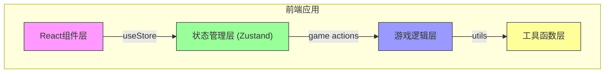

## 1. 架构设计



## 2. 技术描述
- 前端：React@18 + TypeScript + Vite
- 样式：TailwindCSS@3
- 状态管理：Zustand
- 图标：使用emoji作为水果图标，无需额外图标库
- 初始化工具：vite-init
- 后端：无需后端，纯前端游戏

## 3. 核心模块结构

```
src/
├── components/
│   ├── GameBoard.tsx      # 5×5游戏棋盘
│   ├── FruitTile.tsx      # 单个水果方块
│   ├── ScorePanel.tsx     # 得分面板
│   ├── Timer.tsx          # 倒计时组件
│   ├── ControlPanel.tsx   # 控制面板
│   └── GameOverModal.tsx  # 游戏结束弹窗
├── store/
│   └── useGameStore.ts    # Zustand状态管理
├── hooks/
│   └── useGameLogic.ts    # 游戏逻辑hook
├── utils/
│   └── gameUtils.ts       # 游戏工具函数
├── types/
│   └── game.ts            # 类型定义
├── App.tsx
├── main.tsx
└── index.css
```

## 4. 类型定义

```typescript
// 水果类型
export type FruitType = 'apple' | 'lemon' | 'grape' | 'orange' | 'kiwi';

// 位置坐标
export interface Position {
  row: number;
  col: number;
}

// 水果方块
export interface Tile {
  id: string;
  type: FruitType;
  position: Position;
  isMatched: boolean;
  isSelected: boolean;
}

// 游戏状态
export type GameStatus = 'idle' | 'playing' | 'gameover';

// 游戏状态
export interface GameState {
  board: Tile[][];
  score: number;
  timeLeft: number;
  status: GameStatus;
  selectedTile: Position | null;
  isAnimating: boolean;
}
```

## 5. 核心工具函数

```typescript
// 1. createBoard(): 创建5×5棋盘，确保初始无匹配
// 2. checkMatches(board): 检测所有匹配（横3连、竖3连）
// 3. removeMatches(board): 移除匹配的水果
// 4. dropFruits(board): 水果下落填充空位
// 5. fillEmpty(board): 填充新水果
// 6. hasValidMoves(board): 检查是否有可消除组合
// 7. shuffleBoard(board): 随机刷新棋盘
// 8. isAdjacent(pos1, pos2): 判断是否相邻
// 9. swapTiles(board, pos1, pos2): 互换两个水果
```

## 6. 状态管理（Zustand）

```typescript
export const useGameStore = create<GameState & GameActions>((set, get) => ({
  board: [],
  score: 0,
  timeLeft: 60,
  status: 'idle',
  selectedTile: null,
  isAnimating: false,
  
  // Actions
  startGame: () => { ... },
  resetGame: () => { ... },
  selectTile: (pos) => { ... },
  handleSwap: (pos1, pos2) => { ... },
  processMatches: () => { ... },
  tickTimer: () => { ... },
}));
```

## 7. 路由定义
| Route | Purpose |
|-------|---------|
| / | 游戏主界面 |

本游戏为单页面应用，无需复杂路由。
